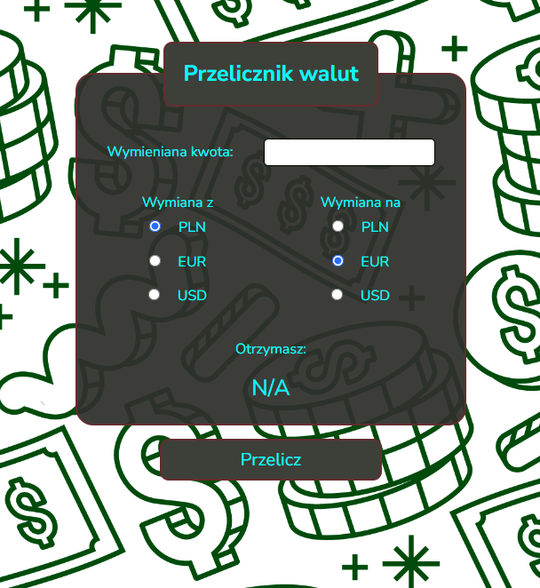

# CURRENCY CONVERTER

## Table of contents

1. [Description](#description)
1. [Technologies](#technologies)
1. [Demo](#demo)

## Description

This is my second project based on the [**YouCode - Frontend Developer Course**](https://youcode.pl). It is a simple currency converter with the 3 most popular currencies, including PLN, EUR and USD.

## Technologies
The application is built with use of:

- *HTML5*
- *CSS3*
- *JavaScript with ES6+ features*
- *BEM methodology*

## Demo

(https://olos1992.github.io/currency-converter2/)
